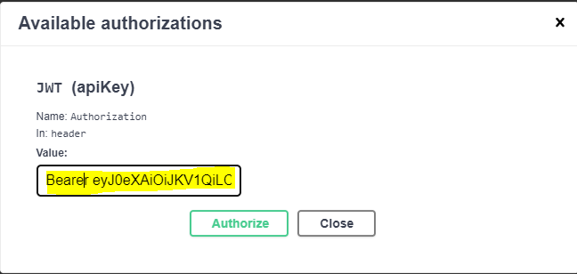

# **API Activity**

### Introduction
This is an activity to apply the acquired  knowledge from API classes. 

### What was proposed
To simulate an API for a Community-Supported Agriculture (CSA) with the following features:
- Database seeding;
- CRUD to all entities;
- Manager login with access to CSA's and participant's creation, update, deletion;
- Participants with access to receipt's create and get (with file submission);
- All users with permission to get CSA's name and id.

### How to execute the application?

    1. Clone the project in your terminal;
    2. Execute the project in your Java IDE;
    3. Open the project in the web:

Index:  `http://localhost:8080/swagger-ui/`

#### How to Authenticate
When starting the application, the user can authenticate with:
- Manager:

    > username: email@email.com 

    > password: YHX10W2PES

**You can create a new participants or manager to access the application with their roles**

#### Database population
The database is seeded automatically when user starts the application.

##### What is automatically in the database?
- 2 CSAs;
- 1 Manager;

##### Tips
- When creating a new participant/user **the new password will be displayed in the console** and the username is the email submitted.
- To authenticate the user to use the rest of the API: copy the token -> go to Authorize -> paste the token with the word "Bearer" in front, 
as shown in the following image:

- The images are saved in C:/temp/csa. If you want to change the path, go to application.properties;
- The images are saved in base64, so "base64Image" option will need to receive a image string in base64;
- When saving a new image, **don't give any folder name**, the name will be given automatically.

### Requirements

- Java
- IDE or Terminal

### Built with
- SpringBoot: framework that facilitates the development processes;
- JPA: "...Improve the implementation of data access layers by reducing the effort to the amount that's actually needed";
- Swagger: "Swagger is an Interface Description Language for describing RESTful APIs expressed using JSON";
- H2: SQL embedded database.
- Spring Security: "...customizable authentication and access-control framework.";
- Flyway: "Flyway is an open-source database-migration tool";
- JWT: "JSON Web Tokens are an open, industry standard RFC 7519 method for representing claims securely between two parties";
- Commons FileUpload: Package that "makes it easy to add robust, high-performance, file upload capability to your servlets and web applications";

### TODO
- Delete Receipt;
- Work on Exception handling;
- Work on authentication and authorization.

